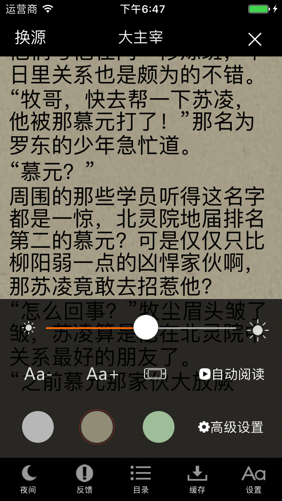

# zhuishushenqi

**采用Swift语言，仿追书神器做的，主要是练习阅读器的一些技术，包括仿真阅读等。不断更新中......**

**20170607：本次功能变更：增加书架删除，缓存，修复一些缺陷**

**20170612: 本次功能变更：增加开屏广告，增加首次安装新特性，推荐书籍等**

**20170808：本次功能变更：充分利用Swift语言特性，整合API，引入CocoaPods管理三方库**

**20171219: 本次功能变更: 适配iPhone X**

**20180110: 本次功能变更：修复了iOS 11 上阅读器文字不显示问题**

**20180403: 本次功能变更：阅读器内存优化，内存保持稳定**

**20180606: 本次功能变更: Swift语言更新至4.0**

**20180726: 本次功能变更: 阅读器代码优化**

**20180803: 本次功能变更: 增加本地书籍阅读功能**

**20180819: 本次功能变更: 追书社区新增大量功能,侧滑菜单新增大量功能**

**20180828: 本次功能变更: 评论区增加图文混排功能,正确展示评论中的图片及链接**

**20180919: 本次功能变更: 适配Swift4.2及Xcode10**

**20181002: 本次功能变更: 添加手机登录及三方登录功能**

**20181025: 本次功能变更: 添加登录后书架信息同步**

**20181102: 本次功能变更: 添加自动签到功能,进入APP即可自动签到**

**20190102: 本次功能变更: 修复书架刷新卡顿&阅读过的书籍置顶(branch dev_db)**

**20180321：本次功能变更：修复多个缺陷，分类页面优化**

**20190409：本次功能变更：修复书架删除书籍时误删整个书架的问题**

**20190622: 本次功能变更：Swift 5.0支持**

**20200103: 本次功能变更：搜索页增加热门推荐与搜索历史**

**20200106: 本次功能变更：来源功能手动添加支持&删除carthage支持**

**20200221：本次功能变更：切换翻页方式功能添加（支持pageCurl，左右平移，无动画效果）**

**20200517：本次功能变更：书架内容展示添加最近更新章节 **

----

**仅供学习交流，请勿用于商业用途**

## Requirements

- iOS 9.0+ / macOS 10.14+ / tvOS 9.0+ / watchOS 2.0+
- Xcode 10.2+
- Swift 5.0+

Main development of zhuishushenqi olny support Swift 5.0+.

## Install

请执行以下两步操作，确保所有的依赖库安装完成后使用.

**CocoaPods:**

`$ pod install`

**Carthage:**

`$ carthage update --platform iOS`

###Here you can see blow.

=======

###效果图如下：

<!--

-->

## Contact

Follow and contact me on mail [2252055382@qq.com](https://mail.qq.com/). If you find an issue, just [open a ticket](https://github.com/NoryCao/zhuishushenqi/issues/new). Pull requests are warmly welcome as well.

## License

zhuishushenqi is released under the MIT license. See LICENSE for details.

