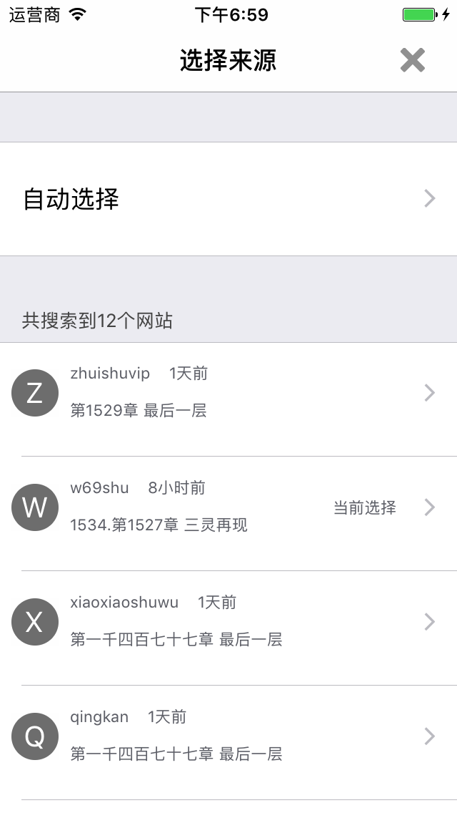

# zhuishushenqi

**采用Swift语言，仿追书神器做的，主要是练习阅读器的一些技术，包括仿真阅读等。不断更新中......**

**20170607：本次功能变更：增加书架删除，缓存，修复一些缺陷**
----

**仅供学习交流，请勿用于商业用途**

## Requirements

- iOS 8.0+ / macOS 10.10+ / tvOS 9.0+ / watchOS 2.0+
- Xcode 8.1+
- Swift 3.0+

Main development of TXTReader olny support Swift 3.0+.

###Here you can see blow.

=======

###效果图如下：

<!--

-->

## Contact

Follow and contact me on mail [2252055382@qq.com](https://mail.qq.com/). If you find an issue, just [open a ticket](https://github.com/TomasEdison/TXTReader/issues/new). Pull requests are warmly welcome as well.

## License

zhuishushenqi is released under the MIT license. See LICENSE for details.

