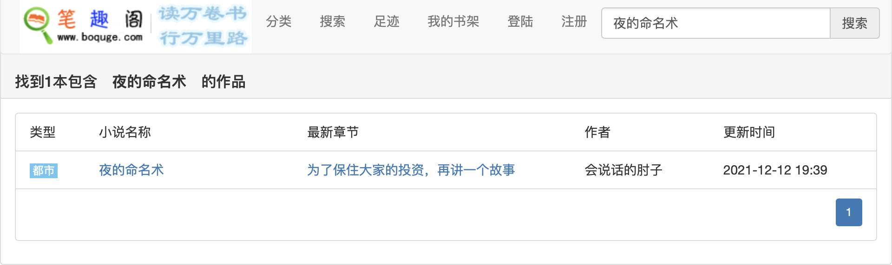
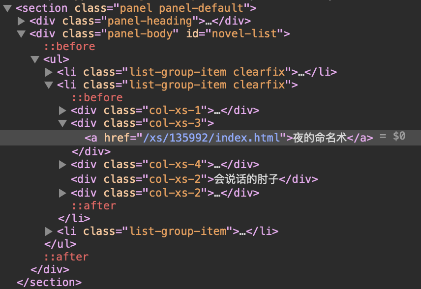

### 添加来源

如果默认的一些书籍来源搜索不到小说，该怎么办？ 这时候，你需要自定义小说来源网站

以 [笔趣阁](http://www.boquku.com)为例

#### 1. 打开 [笔趣阁](http://www.boquku.com)网站，搜索【夜的命名术】


#### 2. 在网页点击右键，选择检查网页


#### 3. 找到唯一能定位搜索结果的标签
````
<div class="panel-body" id="novel-list">
		<ul><li class="list-group-item clearfix">
			<div class="col-xs-1">类型</div>
			<div class="col-xs-3">小说名称</div>
			<div class="col-xs-4">最新章节</div>
			<div class="col-xs-2">作者</div>
			<div class="col-xs-2">更新时间</div></li><li class="list-group-item clearfix">
			<div class="col-xs-1"><i class="tag-blue">都市</i></div>
			<div class="col-xs-3"><a href="/xs/135992/index.html">夜的命名术</a></div>
			<div class="col-xs-4"><a href="/book/135992/178501916.html">为了保住大家的投资，再讲一个故事</a></div>
			<div class="col-xs-2">会说话的肘子</div>
			<div class="col-xs-2"><span class="time">2021-12-12 19:39</span></div>
		</li>
		
		
		
		
		<li class="list-group-item"><div class="listMore"><ul class="pagination pagination-sm">
		<li class="active"><a href="">1</a></li></ul></div></li>
		</ul>
		</div>
````

#### 4. 根据xpath取值获取，获取所有搜索结果
例如

- books: .panel-body ul li
- bookName: @.col-xs-3 a@0@
- bookAuthor: @.col-xs-2@0@
- bookUrl: @.col-xs-3 a@0@abs:href
- bookLastChapter: @.col-xs-4 a@0@

**@**为分隔符，分割标签与序号
以 **bookName** 为例：
bookName为定位某一个具体的标签

第一个【@】后面的**.col-xs-3 a**指定对应的标签的定位，一般指定的标签具有唯一性

第二个【@】后面的数字为序号，一般为0，特殊情况也可取具体数字

第三个【@】后面的一般用于获取链接的具体值，固定abs:href或者abs:src，根据具体的标签来看

> .col-xs-3 表示class为col-xs-3的标签，如果没有class，而是只有id，则需要遵循css选择器,改为 `#col-xs-3`

#### 5. 获取详情页内容
这一步获取到小说的以下内容

- detailBookIcon: @.col-xs-2 img@0@abs:src
- chapters: .list-group-item li a
- detailChaptersUrl: @.list-group li a@12@abs:href 
- detailBookDesc: @p#shot@0@

> 【detailChaptersUrl 这里有一个更简洁的写法,  @.list-group-item tac a@0@abs:href, 为啥不用他呢，因为list-group-item后面的tac并不是一个标签层级，而我们用空格区分标签的层级，所以识别会失败，后面考虑将空格分割法改为其他的特殊符号】
> 【chapters比较特殊，假如从小说页面找不到所有的章节，而需要点击链接进入下一级页面的话，就需要detailChaptersUrl的值】
> 【获取列表的时候，直接写标签路径就可以了，如chapters这种】
> 【detailChaptersUrl 章节要获取到a标签，方便后面取值】

#### 6. 获取具体章节名及章节链接

- chapterName: @@@
- chapterUrl: @@@abs:href

#### 7. 获取章节内容
- content: @div#txtContent@0@
- contentReplace:
- contentRemove:

#### 8. 获取网页编码，搜索链接
- searchEncoding: .gbk
- searchUrl: http://www.boquge.com/search.htm?keyword=%@
- host: https://www.boquge.com/
- name: boquge

#### 9. 验证规则正确性
在 我的->设置->书籍规则验证页面进行验证

附上[http://www.yetianlian.com/](http://www.yetianlian.com/) 网站实例

- searchEncoding: .utf8
- searchUrl: http://www.yetianlian.com/s.php?ie=utf-8&q=%@
- books: .bookbox
- bookName: @.bookname a@0@
- bookAuthor: @.author@0@
- bookUrl: @.bookname a@0@abs:href
- bookLastChapter: @.update a@0@
- bookIcon: @.bookimg a@0@abs:href
- bookUpdateTime: 
- chapters: .listmain dl dd a
- detailBookDesc: @.intro@0@
- chapterName: @@@
- chapterUrl: @@@abs:href
- content: @div#content@0@
- host: http://www.yetianlian.com/
- name: 何以笙箫默


